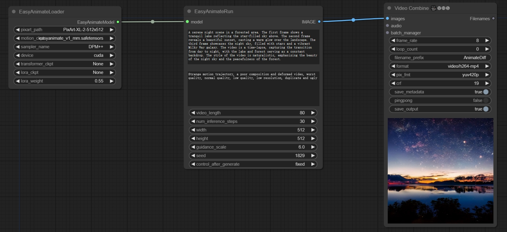

# ComfyUI-EasyAnimate

## workflow

[basic](https://github.com/chaojie/ComfyUI_EasyAnimate/blob/main/workflow/wf.json)

### 1、Model Weights
| Name | Type | Storage Space | Url | Description |
|--|--|--|--|--| 
| easyanimate_v1_mm.safetensors | Motion Module | 4.1GB | [download](https://pai-aigc-photog.oss-cn-hangzhou.aliyuncs.com/easyanimate/Motion_Module/easyanimate_v1_mm.safetensors) | ComfyUI/models/checkpoints |
| PixArt-XL-2-512x512.tar | Pixart | 11.4GB | [download](https://pai-aigc-photog.oss-cn-hangzhou.aliyuncs.com/easyanimate/Diffusion_Transformer/PixArt-XL-2-512x512.tar)| ComfyUI/models/diffusers (tar -xvf PixArt-XL-2-512x512.tar) |

### 2、Optional Model Weights
| Name | Type | Storage Space | Url | Description |
|--|--|--|--|--| 
| easyanimate_portrait.safetensors | Checkpoint of Pixart | 2.3GB | [download](https://pai-aigc-photog.oss-cn-hangzhou.aliyuncs.com/easyanimate/Personalized_Model/easyanimate_portrait.safetensors) | ComfyUI/models/checkpoints |
| easyanimate_portrait_lora.safetensors | Lora of Pixart | 654.0MB | [download](https://pai-aigc-photog.oss-cn-hangzhou.aliyuncs.com/easyanimate/Personalized_Model/easyanimate_portrait_lora.safetensors)| ComfyUI/models/checkpoints 

## [EasyAnimate](https://github.com/aigc-apps/EasyAnimate)